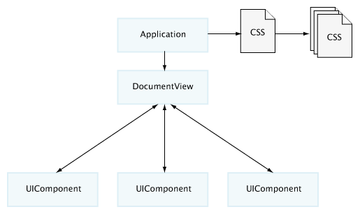

title: Introduction to the Reprise Framework
toc-title: Introduction
toc-sort-order: 1

# The Reprise Framework

## About Reprise

Reprise is an ActionScript application development framework with a heavy emphasis on seperating application logic, data and layout.
As the name implies, Reprise doesn't try to invent new concepts for every functionality. Instead, it implements concepts that have been successful in other contexts. Most importantly, the styling system is an implementation of the W3Cs' CSS standard, allowing web developers to reuse their knowledge in creating good HTML/ CSS pages to get up to speed with developing Reprise applications quickly.

### building blocks

 - a powerful and easily extendable runtime CSS parser/ renderer supporting most of CSS2.1 and many parts of CSS3
 - a modular and highly configurable renderer for XML structures
 - a component structure supporting pluggable layout mechanisms and view state transitions expressed in CSS
 - uniform resource and command handling
 - a range of highly configurable and stylable controls
 - thorough support for input elements, includings easy to use multi-page forms

Reprise is thoroughly tested and actively developed and used in a diverse range of projects.

## A typical setup for a Reprise application
Implementing up a Reprise application typically consists of the following basic steps:

 1. Create custom components for all functionality not easily attained by using basic components (Note that the need to create custom components for visual effects is drastically reduced by the powerful styling system.)
 1. Register these components as handlers for XML node types, CSS classes, CSS IDs or input types
 1. Create the application structure as an XML document
 1. Create the applications design as a CSS stylesheet
 1. Implement any additional application logic and backend integration using resources and commands

