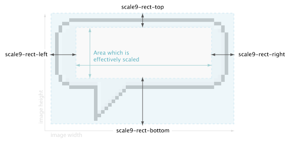
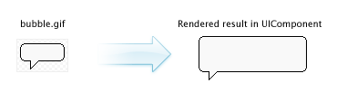

title: CSS Background property
toc-title: Background

## background

### Description
A shorthand property for setting all background properties in one declaration. __Background attachment
is not supported!__

### Values
* `background-color`
* `background-image`
* `background-repeat`
* `background-position`

### Examples
	background: #FF0000
	background: url(stars.gif) no-repeat top
	background: #00FF00 url(stars.gif) no-repeat top right

***

## background-image

### Description
Sets an image as the background. This can either be a bitmap or a SWF file.

### Examples
	background-image: url(url/to/my/image.png);

***

## background-color

### Description
Declares the background color.

### Values
Valid color names, RGB values, RGBA values, hexidecimal notation.

### Examples
	background-color: #fff; /* 100% white */
	background-color: #ffffff7f; /* 50% white */
	background-color: rgb(255, 255, 255); /* 100% white */
	background-color: rgba(255, 255, 255, .5); /* 50% white */

***

## background-repeat

### Description
The background-repeat property sets if/how a background image will be repeated.

### Values
`repeat`
: Default. The background image will be repeated vertically and horizontally.

`repeat-x`
: The background image will be repeated vertically.

`repeat-y`  
: The background image will be repeated horizontally.

`no-repeat`  
: The background image will be displayed only once.

### Examples
	background-repeat: repeat-x;
	background-repeat: no-repeat;

***

## background-position

### Description
The background-position property sets the starting position of a background image.

### Values
* top
* left
* center
* right
* bottom
* x%
* y%
* x px
* y px

### Examples
	background-position: 0% 100%
	background-position: bottom right
	background-position: 5px 10px

***

## background-renderer

***

## background-blend-mode

***

## background-gradient

***

## background-gradient-colors

***

## background-gradient-type

***

## background-gradient-ratios

***

## background-gradient-rotation

***

## background-scale-9

***

## background-scale-9-type

***

## background-scale9-rect

### Description
Scales a background image according to a user defined scaling rect. With Scale 9 you can resize 
images without having distorted them. The defined rect is applied to the current background image
and uses the size of the element in which the background image is drawn.

### Values
* `background-scale9-rect-top`
* `background-scale9-rect-right`
* `background-scale9-rect-bottom`
* `background-scale9-rect-left`

### Examples

	background-scale9-rect: 9px 8px 17px 24px; /* top right bottom left */

***

## background-scale9-rect-top

***

## background-scale9-rect-right

***

## background-scale9-rect-bottom

***

## background-scale9-rect-left

***

## background-image-type

***

## background-image-preload