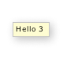
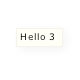
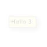

title: CSS Text properties
toc-title: Text

## color

### Description
Set text color

### Values
* rgb
* rgba
* hex

***

## rasterize-device-fonts

### Description
Enables device fonts to be converted into BitmapData in labels. This is helpful if you want to change the opacity of your label without embedding fonts. Non-embedded fonts could otherwise not have different opacity levels (only visible and invisible) and could not be masked. This style is inheritable.

### Values
* true _or_ rasterize
* false

### Example
	
	#Tooltip
	{
		rasterize-device-fonts: true;
	}

| Tooltip with full opacity | Tooltip with 20% opacity  rasterize-device-fonts disabled | Tooltip with 20% opacity  rasterize-device-fonts enabled |
| ------------------------- | ------------------------------------------------------------ | -------------------------------------------------------- |
|  |  |  |